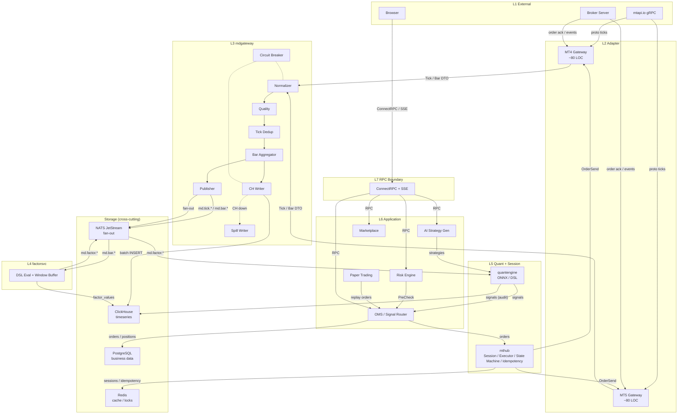

# 00 -- Architecture Overview (One-Page Summary)

> Audience: new contributor onboarding, architecture review, cross-team alignment.
> This is a **summary** document. For full detail, follow the links in each section.

## 1. Data Flow Diagram

Edges are labeled with data types. Transport: gRPC (mtapi.io, browser), Go chan (internal hot path), NATS JetStream (fan-out), PG/CH/Redis (storage).

## 2. Seven-Layer Architecture

**L1 -- External interfaces.** mtapi.io gRPC for MT4/MT5 brokers; browser is the sole end-user surface. ant never writes raw MT protocol code. See [01-vision.md](../architecture/01-vision.md).

**L2 -- MT Adapter** (``adapter/mt4/``, ``adapter/mt5/``). Pure translation: mtapi proto to ant internal DTOs (``Tick``, ``Bar``, ``OrderInfo``). No normalization, quality, or storage. ~80 lines each. See [10-mt-adapter.md](10-mt-adapter.md).

**L3 -- Market Data Gateway** (``mdgateway/``). Reliability bedrock: normalize symbols to canonical form, quality checks (bid>ask, outlier, gap, clock skew), 100-tick dedup, tick-to-bar OHLCV aggregation (6 periods), NATS publish, ClickHouse write (spill-to-disk fallback), per-account circuit breaker. See [11-mdgateway.md](11-mdgateway.md).

**L4 -- Factor Service** (``factorsvc/``). Subscribes to NATS ``md.bar.*``, maintains rolling window buffers per (canonical, period, factor), evaluates DSL expressions, writes to CH ``factor_values``, publishes to NATS ``md.factor.*``. See [11-mdgateway.md](11-mdgateway.md).

**L5 -- Quant Engine + Session Hub** (``quantengine/`` + ``mthub/``). Quantengine: ONNX/DSL inference from factor values to trading signals. mthub: MT session registry, unified ``OrderExecutor``, 10-state order state machine, Redis-based idempotency (24h TTL), reconciliation loop (startup + every 30s). See [12-mthub.md](12-mthub.md), [22-order-state-machine.md](22-order-state-machine.md).

**L6 -- Application Orchestration** (``ai/``, ``risk/``, ``oms/``, ``paper/``, ``marketplace/``). AI: natural language to strategy code. Risk: 4-item synchronous pre-trade check + async margin monitor. OMS: signal-to-execution routing (live or paper). Paper: simulated fills with configurable slippage/latency. Marketplace: strategy publishing infrastructure (M11+). See specs 23-26.

**L7 -- RPC Boundary** (``connect/`` + ``proto/ant/v1/``). ConnectRPC + SSE, sole frontend interface. Handlers: validate, call service, convert to proto, return. No business logic. See [14-rpc-contracts.md](14-rpc-contracts.md).

## 3. Data Ownership Matrix (ADR-0006 + Migration 110)

### Platform Shared (no ``user_id``, all users can read)

| Table | Content | Notes |
|---|---|---|
| ``platform_strategies`` | Official + user-published strategies | Replaces per-user ``seed_default_templates.go`` |
| ``platform_factors`` | Built-in MA/RSI/MACD/Bollinger etc. | Single instance, not per-user copy |
| ``platform_ai_agents`` | Default AI agent templates | Replaces hardcoded ``defaultAgentTemplates`` |
| ``broker_symbols`` | Broker-to-canonical symbol mapping | Already platform-shared |
| ``admins`` | Platform operators, independent auth | Replaces ``users.role='admin'`` |

### User Private (must have ``user_id`` + RLS)

| Table | Content | Notes |
|---|---|---|
| ``mt_accounts`` | User-bound broker accounts | Core account binding |
| ``user_strategies`` | Forked or custom strategies | Per-user ownership |
| ``user_factor_overrides`` | Personalized factor parameters | Overrides, not new factor instances |
| ``user_ai_agents`` | Personalized AI agent configs | Forked from ``platform_ai_agents`` |
| ``orders`` / ``positions`` / ``trades`` | Live trading state | Per-account + per-user |
| ``user_subscriptions`` | Strategy/copy-trade subscriptions | Cross-user relationships |
| ``copy_trade_links`` | Copy-trade routing | ``subscription_id`` + ``from/to_account_id`` |
| ``user_strategy_publishes`` | User-published strategy registry | ``user_id`` + ``platform_strategy_id`` |

Never replicate official/platform data inside user-scoped tables. Source: [ADR-0006](../adr/0006-platform-shared-vs-user-private.md), [migration 110](../../backend/migrations/110_platform_tables.up.sql).

## 4. Storage Boundaries

| Store | What it holds | Key characteristics |
|---|---|---|
| **PostgreSQL 18** | Business data: users, accounts, strategies, orders, positions, trades, risk configs, AI agents, subscriptions | ACID, ``NUMERIC(20,8)`` for prices, RLS on ``user_*`` tables |
| **ClickHouse 24** | Timeseries: ``md_ticks``, ``md_bars``, ``factor_values``, ``signals`` | Columnar, ``Decimal(18,6)`` for prices, append-only (no UPDATE of historical rows), bar ``version`` for revisions |
| **Redis 8** | Session cache, idempotency keys (24h TTL), distributed locks, SSE pub-sub | Volatile; idempotency keys survive process restart within TTL |
| **NATS JetStream** | Real-time fan-out: ``md.tick.*``, ``md.bar.*``, ``md.factor.*``, ``oms.events.*``, ``bar.revision.*`` | At-least-once, < 100us in-process latency via goroutine channels preferred for hot path |

## 5. Key Invariants

These are the "constitution" of ant v2. See [02-overview.md](../architecture/02-overview.md) section 8 for the full list of 20.

1. **Canonical at L3 entry.** Adapter (L2) produces ticks with empty ``Canonical``. ``Normalizer.Resolve`` (L3, step 1) fills it. All downstream code sees non-empty canonical.
2. **Zero Python on the production path.** From NATS factor to broker order ack, the entire chain is Go. Python is research-mode only.
3. **Price type discipline.** PG ``NUMERIC(20,8)``, Go ``decimal.Decimal``, CH ``Decimal(18,6)``. Never ``float64``.
4. **CH write never blocks the hot path.** CHWriter channel full triggers SpillWriter (jsonl rotation). CH down for minutes is survivable.
5. **Circuit breaker is per-account.** One broker failure does not affect other accounts. Sliding window: 5 failures opens breaker for 30s, 2 consecutive successes closes it.
6. **Platform shared vs user private (ADR-0006).** ``platform_*`` tables have no ``user_id`` and are readable by all. ``user_*`` tables require ``user_id`` + RLS. No per-user duplication of official data.
7. **Backtest and live share one code path (ADR-0012).** ``factorsvc`` and ``quantengine`` depend only on ``Source`` interface (``LiveSource`` / ``ReplaySource``). Zero ``if isBacktest`` branches in business logic.
8. **Orders are immutable once filled (ADR-0013).** Parameters cannot change after ``FILLED`` / ``PARTIALLY_FILLED``. Use reverse orders to adjust positions.

CI enforces 1, 2, 3 via lint; remainder via code review.

## 6. Quick Reference

### Spec Documents (``docs/spec/``)

| Spec | Topic |
|---|---|
| [10-mt-adapter.md](10-mt-adapter.md) | MT4/MT5 adapter layer (L2) |
| [11-mdgateway.md](11-mdgateway.md) | Market data gateway (L3) |
| [12-mthub.md](12-mthub.md) | Session hub + order execution (L5) |
| [13-clickhouse-schema.md](13-clickhouse-schema.md) | ClickHouse table schemas |
| [14-rpc-contracts.md](14-rpc-contracts.md) | ConnectRPC service contracts (L7) |
| [15-observability.md](15-observability.md) | Metrics, logging, tracing, health checks |
| [16-mtapi-quirks-register.md](16-mtapi-quirks-register.md) | Known mtapi behavioral quirks |
| [17-secrets-and-errors.md](17-secrets-and-errors.md) | Secret management + error taxonomy |
| [18-backfiller.md](18-backfiller.md) | Historical bar backfill |
| [19-md-doctor.md](19-md-doctor.md) | Market data self-healing diagnostics |
| [20-slo.md](20-slo.md) | Service level objectives |
| [21-backtest-replay.md](21-backtest-replay.md) | Backtest replay engine |
| [22-order-state-machine.md](22-order-state-machine.md) | 10-state order state machine |
| [23-risk-management.md](23-risk-management.md) | Risk engine (pre-trade + async) |
| [24-paper-trading.md](24-paper-trading.md) | Paper/simulation trading |
| [25-bar-revision-cascade.md](25-bar-revision-cascade.md) | Bar revision cascade handling |
| [26-ai-strategy-generation.md](26-ai-strategy-generation.md) | AI strategy generation pipeline |
| [27-signal-execution-slo.md](27-signal-execution-slo.md) | Signal-to-execution latency SLO |
| [31-saas-foundation.md](31-saas-foundation.md) | SaaS foundation (M11+) |

### Architecture Documents (``docs/architecture/``)

| Doc | Topic |
|---|---|
| [01-vision.md](../architecture/01-vision.md) | Design philosophy: MT is the foundation |
| [02-overview.md](../architecture/02-overview.md) | Full architecture reference (authoritative) |
| [03-data-flow.md](../architecture/03-data-flow.md) | 12 data flow sequence diagrams |

### ADR Index

[ADR README](../adr/README.md) -- 19 accepted ADRs (0001--0019) covering MT rewrite, C2C ownership, storage alignment, SLO framework, backtest/live unification, order state machine, risk management, paper trading, bar revisions, AI strategy generation, and signal execution latency.
